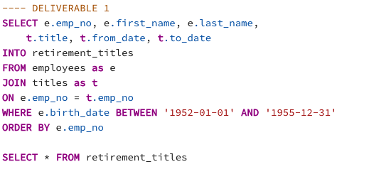

# pewlett-hackard_analysis

# Overview

This project analyzed over 300,000 employee records and six CSV files with overlapping data for a hypothetical company.  PostgreSQL was used to construct the tables and import the CSV files for data quality and control.  The data from the tables were used to identify employees that may be approaching retirement age and create a report of tenured employees that would be suitable to create a mentorship program.  

# Results 

The first deliverable created a SQL database called `retirement_titles` by joining two tables and filtering for employees born within a given range.  In the code, the original table names are shorted to make the code more readable and efficient

Many employees have changed roles over the years, so they appear as duplicates within the employee titles table.  The second table presents unique employees who are still with the company and may be approaching retirement using the `DISTINCT ON` function.  

This presentation is broken out by title to present to the heads of different business units.  

Throughout the project there was a steep learning curve debugging code, dropping and creating tables, refreshing, and importing data into the tables in the correct order!  

# Summary 

Based on the analysis conducted 72,458 active employees are approaching retirement or almost a quarter of the company’s entire workforce, presenting a massive logistical challenge.  

There are 1549 qualified employees identified to take on mentorship roles.  Assuming not everyone participates, about a 1:5 ratio of mentor to mentee should be sufficient.  

As an interesting aside, it seems like the company stopped hiring new employees born after 1965.  I attempted to extend the search parameters for mentors, but even stretching the birthdate out to 1990 did not yield a single additional eligible mentor from the employee data!  

